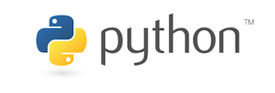

# Inleiding Programmeren <small>Studiewijzer</small>

**Versie: Januari 2024**

{:.inline}  

We gaan programmeren in Python, een eenvoudige taal met vele mogelijkheden. Je leert over de basis van het programmeren, maar je gaat vooral aan de slag met toepassingen uit verschillende wetenschapsgebieden.

## Team
<table>
  <tr><td> Amir </td><td> Ik ben Amir en ik doe de Masters Computational Science, hier ben ik bezig met het simuleren van complexe systemen. Ik TA al een tijdje dus ik hopelijk kan ik je goed op weg helpen! </td></tr>
  <tr><td> Coen </td><td> Coen van den Elsen
Bachelor Beta gamma (major KI) afgerond met exchange
nu AI master aan de uva </td></tr>
  <tr><td> Daan </td><td> Hoi!
Ik ben Daan, master AI student en ik heb in het verleden psychologie aan de UvA gedaan met een specialisatie in brain and cognition (die ook als major bestaat bij beta-gamma). Daarnaast heb ik de bachelor KI gedaan en een half jaar in Chili gestudeerd via het exchange programma van de uva. Je mag me alles vragen over programmeren, maar ook over studies/studiekeuze of andere dingen die je boeien :) </td></tr>
  <tr><td> Daniël </td><td> ... </td></tr>
  <tr><td> Jacob </td><td> Ik ben Jacob Groot, 4e jaars economie student. Tijdens mijn studie heb ik de minor AI afgerond en vond dit zo vet dat ik nooit gestopt ben met programmeren en AI. Naast dit vak ben ik inmiddels ook TA voor de minor AI waar het allemaal begon. Ik heb er zin in! </td></tr>
  <tr><td> Marit </td><td> Hoi! Ik ben Marit en ben inmiddels derdejaars Bèta Gamma student. Ik doe de major KI, dus als je daar vragen over hebt kun je altijd bij mij terecht (naast je programmeervragen natuurlijk ;)). </td></tr>
  <tr><td> Melanie </td><td> Hoi, mijn naam is Melanie en ik ben een van de TA’s bij dit vak. Op dit moment volg ik de master Chemistry (UvA / VU). Tijdens mijn bachelor heb ik de minor Artificial Intelligence afgerond, waarbij ik veel programmeerervaring heb opgedaan. Ik kijk ernaar uit om jullie kennis te laten maken met programmeren en te helpen tijdens dit vak! </td></tr>
  <tr><td> Roan </td><td> Hoi! Ik ben Roan en ik doe de Master Artificial Intelligence! Binnen deze master hoop ik mij meer te focussen op Computer Vision en Deep Learning. Daarnaast heb ik vorig jaar ook de Bachelor Bèta-gamma met de major Kunstmatige Intelligentie afgerond. Mocht je vragen hebben over deze de major of iets anders stel ze vooral! </td></tr>
  <tr><td> Simon </td><td> Hoi, ik ben Simon. Ik heb zelf Informatica en daarna de Master of Logic aan de UvA gestudeerd. Ik heb een deel van mijn studie in Parijs (Paris 1) gevolgd. Ik heb onderzoek gedaan aan op het gebied van computationele taalkunde en robotica bij Sony, Aldebaran (nu Softbank), Universtitat Autònoma de Barcelona en de UvA. Op dit moment ben ik full-time docent bij de Minor Programmeren en geef vershchillende programmeervakken bij verschillende opleidingen.</td></tr>
</table>

## Vragen

Tijdens de practica van dit vak staan de **assistenten** voor je klaar en je kunt bij ze terecht met vragen over het programmeren, maar ook over de nagekeken opdrachten en tips over het vak.

Het kan zijn dat je om één of andere reden een uitzondering nodig hebt op de regels van het vak. Deze kun je alleen krijgen bij de **coördinator** en niet bij de assistenten. Stuur een mail naar <progbg@mprog.nl> en leg even kort uit wat je situatie is. Ben je bang een achterstand op te lopen van meer dan een dag? Neem dan razendsnel contact op!

## Verwachtingen

In deze cursus ga je aan de slag met programmeeropdrachten, waardoor je de taal Python leert en bovendien de standaardaanpak voor een aantal wetenschappelijke problemen leert kennen. Om echt te leren programmeren is veel oefening nodig, dus bovenal verwachten we dat je **alle opdrachten volledig werkend maakt**.

> Samenwerken tijdens dit vak is niet toegestaan (tenzij expliciet anders vermeld). Dit vak heeft als voornaamste doel jouw persoonlijke programmeervaardigheid te ontwikkelen. Bij vervolgvakken is het vaak wél mogelijk om samen te programmeren. Zie verder de opmerkingen over plagiaat, onderaan deze studiehandleiding.

## Leerdoelen

Wat willen we dat je kunt aan het einde van deze cursus?

* Je kunt de aangeboden standaardoplossingen voor wetenschappelijke programmeerproblemen toepassen op variaties van de problemen.
* Je kunt een omschrijving van een programma omzetten naar werkende code.
* Je kunt bijgeleverde bibliotheken gebruiken in je eigen programma's.
* Je kunt code overzichtelijk en beter leesbaar maken door een
  consistente stijl toe te passen.
* Je kunt enkele veelvoorkomende programmeerfouten opsporen en verbeteren.

## Activiteiten

Het vak bestaat uit drie programmeer modules en een tentamen. Vanaf de eerste dag van de cursus ga je oefenen met het omzetten van een idee voor een programma naar werkende Python-code. Elke module bestaat uit verschillende onderdelen:

- _theory_: Uitleg van de programmerconcepten. Dit is meestal in de vorm van korte filmpjes (<2 min.) en wat geleidende tekst.
- _practice_: Dit zijn korte oefenopdrachten die je niet hoeft in te leveren. Het doel van hiervan is om voor jezelf te zien of je de theorie ook echt begrepen hebt.
- _assignment_: Dit zijn grotere opdrachten die je moet invleveren. Hiervoor is het belangrijk goed op de deadlines te letten. Dit zijn individuele opdrachten. Je mag bij deze onderdelen dus **niet samenwerken**.
- _PAIR assignment_: Dit zijn (vaak wat complexere) opdrachten die je samen met één iemand anders mag maken. Je moet duidelijk aangeven in het commentaar van je programma en bij het inleveren met wie je samenwerkt. Je mag hierbij niet met meer dan één ander persoon samenwerken.

Het vak heeft laptopcolleges en wrkcolleges. Tijdens de laptop colleges ga je aan de modules programmeren en kan je daarbij hulp krijgen van ons. Tijdens de werkcolleges gaan we dieper in op de theorie.

Het vak sluiten we af met een tentamen. Omdat het mogelijk is ongemerkt mee te liften met een medestudent tijdens het maken van de practica (als je steevast overlegt over de manier van code schrijven), checken we met behulp van het tentamen nog een keer of je zelfstandig de leerdoelen van het vak gehaald hebt.

### Deadlines

Omdat het vak zo kort is, is het zeer belangrijk om op schema te blijven. We daarom voor elke module naast de einddeadline ook een aantal dagdeadlines (deadlines voor specfieke *assignments*).

In de table hieronder kan je alle deadlines vinden.

| week/dag | ma                           | di                              | wo                           | do                             | vr       |
|----------| ---------------------------- | ------------------------------- | ---------------------------- | ------------------------------ | -------- |
| week 1   | module 1   dagdeadline 1 | module 1   dagdeadline 2    |                              | module 1   dagdeadline 3   |          |
| week 2   | module 1   dagdeadline 4 |                                 | **module 1   einddeadline** | module 2   dagdeadline 1   |          |
| week 3   | module 2   dagdeadline 2 |                                 | **module 2   einddeadline** | module 3   dagdeadline 1   |          |
| week 4   | module 3   dagdeadline 2 |    |**module 3   einddeadline** || tentamen |

De tijd van elke deadline is om **18:00**. Het is geen probleem als de opdrachten een paar minuten later worden ingeleverd, bijvoorbeeld in geval van technische problemen.

**Deadlines voor dit vak zijn strikt.** Het vak is zo kort dat er geen tijd is voor uitloop. Nu kan het wel eens voor komen dat je een deadline echt niet kan halen (door ziekte, bijvoorbeeld). Om ervoor te zorgen dat dat niet onmiddelijk een probleem geeft, krijg je 5 te-laat-credits. Elke keer dat je een onderdeel een dag te laat inlevert kost je dat een credit (2 dagen te laat is dus 2 credits). Je mag dus niet vaker dan 5 keer iets een dag te laat inleveren. Als je hieroverheen dreigt te gaan, neem dan contact op met de docent.

## Eindcijfer

Het eindcijfer is samengesteld uit de resultaten van de opdrachten en dat van het tentamen.

| onderdeel | beoordeling                                 | gewicht |  
| --------- | ------------------------------------------- | ------: |
| module 1  | volledigheid, correctheid, stijl en ontwerp |     33% |  
| module 2  | volledigheid, correctheid, stijl en ontwerp |     33% |  
| module 3  | volledigheid, correctheid, stijl en ontwerp |     33% |  
| tentamen  | correctheid                                 |      0% |  

Je krijgt een eindcijfer voor dit vak als je:

* alle tussentijdse opdrachten op tijd hebt ingeleverd;
* elke module op tijd en naar verwachting hebt ingeleverd;
* het tentamen voldoende hebt gemaakt.

Heb je een opdracht niet zichtbaar geprobeerd, of heb je het tentamen niet gemaakt, dan krijg je een NA (niet aanwezig). Heb je het tentamen niet gehaald, dan krijg je een NAV en kun je dit tentamen herkansen. Er zijn geen herkansingen voor de opdrachten, ook niet in geval van overmacht, dus lever altijd in wat je hebt en neem altijd contact op met de docent.

Het tentamen is dit jaar een programmeertentamen. Dit wil zeggen dat je het in de zaal een onder toezicht een aantal programmeeropdrachten gaat maken. Je haalt het tentamen als voldoende van deze opdrachten correct weet te maken.

## Beoordeling opdrachten

** (wijzigingen voorbehouden) **

De opdrachten die je tussentijds inlevert (op de dagdeadlines) worden automatisch nagekeken aan de hand van *checkpy*. Je ontvangt vrijwel onmiddelijk feedback over of je het goed hebt gedaan of niet.

Het werk wat je aan het einde van de module inlevert wordt met de hand nagekeken.

Je ontvangt hiervoor drie apparte cijfers: omvang (*scope*), correctheid (*correctness*), en ontwerp (*design*). Voor elk onderdeel krijg je een een waardering van op een schaal van 1 tot 5. Gezamelijk geven deze een je cijfer voor de module. De weging is alsvolgt:

$$
\textrm{punten} = \textrm{scope} \times (\textrm{correctness} \times 3 + \textrm{design} \times 2)
$$

Omvang (*scope*): In hoeverre zijn alle opdrachten gemaakt? (Er een serieuze poging is gedaan.)

Correctheid (*correctness*): In hoeverre zijn alle opdrachten ook correct gemaakt? Dit is voornamelijk gebaseerd op de output van *checkpy*.

Ontwerp (*design*): Programma's moeten niet alleen het "goede" antwoord geven, maar een programma kan zelf ook een bepaalde **kwaliteit** hebben. Is het een ordelijk en leesbaar geschreven algoritme? Kan het korter of duidelijker? Voor het ontwerp krijg je voor elke module een overzicht met kwaliteitsaspecten waar we vooral op letten bij het nakijken. Het uitgangspunt is dat als je die aspecten goed in acht neemt (en alles volledig en correct hebt ingeleverd), dat je dan in ieder geval 3 punten moet kunnen halen voor design.

De beoordeling voor *design* wordt gedaan op de volgende schaal. Je kan 3 punten verdienen door de style guide goed te volgen:

- [1] beperkte aandacht voor de kwaliteitsaspecten
- [2] goed resultaat voor alle aspecten
- [3] zeer goed resultaat voor alle stijlelementen uit de styleguide

Daar bovenop kan je nog 2 punten verdien met een goed doordacht ontwerp van je programma.

- [+1] zichtbaar nagedacht over het ontwerp
- [+2] zeer doordacht ontwerp

Je ontvangt ook feedback voor elke module. Dit is *géén verantwoording* van het cijfer. De feedback bestaat uit een paar (2 á 3) aandachtspunten. Dit zijn de punten waar je het meeste in kan verbeteren. Als je meer feedback wilt hebben kan je daar altijd tijdens de practica om vragen!

## Aanwezigheid

Tijdens de eerste week is er een **aanwezigheidplicht** voor alle geroosterde practica en werkcolleges: zie je persoonlijke rooster op datanose. In latere weken verwachten we dat je bij de practica aanwezig bent als je hulp en uitleg nodig hebt. Er is geen mogelijkheid om hulp per e-mail te krijgen als vervanging van het practicum. Zorg dus dat je op tijd begint, zodat je nog een kans hebt om langs te komen als het nodig is!

## Studielast

De modules kosten je gemiddeld zo'n 19 uur werk: dat is dus meer tijd dan er practicum ingeroosterd is. Mocht je het niet afhebben, dan is het de bedoeling dat je de opdracht thuis nog af maakt. Kom je in de problemen? Neem dan direct contact op met de docenten, per mail.

| onderdeel   | studielast                |     totaal |  
| ----------- | ------------------------- | ---------: |  
| hoorcollege | 4 x 3 uur                 |     12 uur |  
| opdrachten  | 3 x 18 uur + 1 x 10 uur   |     64 uur |  
| tentamen    | 1 x 3 uur + voorbereiding |      5 uur |  
|             |                           | **81 uur** |  

De meeste studenten ervaren een programmeervak als **zwaar**. Dit komt omdat er veel tijd "verloren" gaat aan kleine foutjes, hard nadenken en even uitrusten. Als de frustratie je teveel wordt, laat het dan gerust weten. Weet dat het erbij hoort en onvermijdelijk is. En neem even pauze!

## Literatuur

Het volgende boek is gratis verkrijgbaar. In de cursus staat soms al uitleg uit dit boek. Probeer een balans te vinden in het leren uit de cursusmaterialen, het boek, en het oefenen met voorbeelden.

Allen Downey  
*Think Python* ([download](http://greenteapress.com/thinkpython2/html/index.html))  
Green Tea Press, 2013

## Eerder gevolgd

**Opdrachten** worden dit jaar op een andere manier beoordeeld dan vorig jaar. Daarnaast zijn ze inhoudelijk in meer of mindere mate gewijzigd. Daarom moeten alle modules opnieuw worden ingeleverd. Daarbij is het af te raden gebruik te maken van je uitwerkingen van vorig jaar, zodat je weer goede oefening krijgt en het vak echt haalt. **Tentamen**resultaten van vorige jaren zijn niet overdraagbaar.

## Inzage beoordelingen

Je hebt binnen 30 dagen na bekendmaking van de cijfers recht op inzage van alle soorten toetsen zodat je de manier van nakijken kunt controleren. Vraag na de bekendmaking van de uitslagen zelf om een individuele afspraak met de docent, per e-mail.

## Samenwerken

Samenwerken tijdens dit vak is *niet* toegestaan (tenzij expliciet anders vermeld). Dit vak heeft als voornaamste doel jouw
persoonlijke programmeervaardigheid te ontwikkelen.

Tijdens de practica is het natuurlijk prima als je de opgave bespreekt met de
student die naast je zit. Het is echter niet toegestaan om een regel
code van je medestudenten of van internet over te nemen.

Een belangrijk verschil dus: je kunt discussiëren over de manier waarop je een
probleem aanpakt, maar je kopieert niet de code van anderen. Om het jezelf niet
te makkelijk te maken, is het slim om niet op het scherm van je buren te kijken.

Als je merkt dat je zodanig aan het overleggen bent dat je dezelfde code krijgt
als een medestudent, is het hoog tijd om de assistent om hulp te vragen!

Kom je in tijdnood? Bespreek het even met de docenten. We willen het graag zo
oplossen dat je het vak zelfstandig kunt halen. Programmeren is echt iets dat
je zelf even onder de knie moet krijgen.

## Plagiaatregeling

Deze cursus hanteert de algemene Fraude- en plagiaatregeling van de UvA. Onder plagiaat wordt in ieder geval verstaan:

1. het gebruik maken dan wel overnemen van andermans teksten, gegevens of ideeën zonder volledige en correcte bronvermelding (overnemen van andermans code is hoe dan ook niet toegestaan voor dit vak, met of zonder bronvermelding);
2. het presenteren als eigen werk of eigen gedachten van de structuur dan wel het centrale gedachtegoed uit bronnen van derden, zelfs indien een verwijzing naar andere auteurs is opgenomen;
3. het niet duidelijk aangeven in de tekst, bijvoorbeeld via aanhalingstekens of een bepaalde vormgeving, dat letterlijke of bijna letterlijke citaten in het werk werden overgenomen, zelfs indien met een correcte bronvermelding;
4. het parafraseren van de inhoud van andermans teksten zonder voldoende bronverwijzingen.

Uiteraard is fraude en plagiaat verboden. Hier wordt nauwkeurig op gecontroleerd en streng tegen opgetreden. Bij vermoeden van plagiaat of fraude wordt altijd melding gemaakt bij de Examencommissie. De hoogste sanctie op fraude of plagiaat is volledige uitsluiting van deelname aan alle tentamens, examens of andere vormen van toetsing van de opleiding voor een periode van maximaal 12 maanden of zelfs de definitieve beëindiging van de inschrijving van de betrokkene. Zie voor meer informatie over  de Fraude- en plagiaatregeling van de Universiteit van Amsterdam: www.uva.nl/plagiaat

We gebruiken bij de beoordeling van de programmeeropdrachten plagiaatdetectie. Als blijkt
dat je opgave geheel of gedeeltelijk overeenkomt met een andere inzending of een
uitwerking van internet, dan zijn er twee mogelijkheden.

* Er is een bronvermelding: in dat geval voldoe je niet aan de eis van het
  zelfstandig maken van de opgaven en wordt je inzending afgekeurd. Omdat dit
  meestal na de deadline is betekent dat doorgaans dat je het vak dit jaar niet
  kunt afronden.

* Er is geen bronvermelding: in dat geval rapporteren we aan de examencommissie
  welke inzendingen overeenkomen, waarna de commissie beslist over te nemen
  maatregelen.

## Dankwoord

Gedeelten van deze cursus zijn gebaseerd op:

- UvA's Scientific Programming, <https://sp.proglab.nl/>
- Harvard's CS50, <http://cs50.tv>
