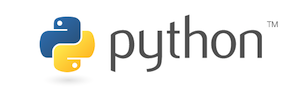
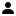
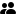
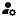

# Programmeren, AI en Samenleving

**Versie: nov/dec 2025**

Je kan de studiewijzer op canvas vinden: [studiewijzer](https://canvas.uva.nl/courses/53197/external_tools/72)

## Aanvulling Studiewijzer

Hieronder wat aanvullingen op de studiewijzer die van belang zijn voor de programmeeropdrachten.

{:.inline}  

We gaan programmeren in Python, een eenvoudige taal met vele mogelijkheden. Je leert over de basis van het programmeren, maar je gaat vooral aan de slag met toepassingen uit verschillende wetenschapsgebieden.

## Team

Dagmar de Graaf, Lara Lemsom, Fleur van Teijlingen, Lisette van Werkhoven, Daniel Kooij, Arja Rydin, Katrin Schulz, Simon Pauw

## Vragen

Tijdens de practica van dit vak staan we tijdens de practica kan je bij ons terecht met vragen over het programmeren.

Het kan zijn dat je om één of andere reden een uitzondering nodig hebt op de regels van het vak. Deze kun je alleen krijgen bij de **docenten** en niet bij de assistenten. Stuur een mail naar <d.e.kooij@uva.nl> en leg even kort uit wat je situatie is. Ben je bang een achterstand op te lopen van meer dan een dag? Neem dan razendsnel contact op!

## Verwachtingen

In deze cursus ga je aan de slag met programmeeropdrachten, aan de hand waarvan je de taal Python leert en bovendien de standaardaanpak voor een aantal wetenschappelijke problemen leert kennen. Om echt te leren programmeren is veel oefening nodig, dus bovenal verwachten we dat je **alle basis opdrachten volledig werkend maakt**.

Samenwerken is alleen toegestaan bij opdrachten waarbij dit expliciet is vermeld. Je moet aan het einde van het vak zelfstandig kunnen programmeren, we verachten dus ook dat je de individuele opdrachten ook helemaal zelfstandig maakt. Zie verder de opmerkingen over plagiaat, onderaan deze studiehandleiding.

## Activiteiten modules

Om het vak voor idereen interessant en nuttig te houden, gelegenheid te bieden om samen te werken en tegelijk te garanderen dat iedereen genoeg individueel werk heeft gedaan zijn er verschillende type opdrachten:

* Basisoprdachten die idereen moet maken. Bestaande uit:
    * {: height="16" } Individuele opdrachten. Je wordt deze geacht zelfstandig te maken. Je mag geen code van elkaar overnemen.
    * {: height="16" } Samenwerkopdrachten. Bij deze opdrachten moedigen we samenwerken juist aan. Je kan hiermee van elkaar leren. En het overnemen van elkaars code is bij deze opdrachten geen bezwaar.
* {: height="16" }: Challenge-opdrachten. Deze opdrachten zijn aanzienlijk moeilijker en zijn bedoeld voor de studenten die het maximale uit dit vak willen halen. Ze zijn niet nodig voor het halen van een voldoende (maar wel voor een cijfer hoger dan 7).

Aan het einde van het vak is een programmertentamen. Omdat het mogelijk is ongemerkt mee te liften met een medestudent tijdens het maken van de practica (als je steevast overlegt over de manier van code schrijven), checken we met behulp van het tentamen nog een keer of je zelfstandig de leerdoelen van het vak gehaald hebt.

### Beoordeling modules

Elke module bestaat uit een aantal onderdelen waar je punten voor kan verdienen. Er zijn de basisonderdelen en de *challenge* opdrachten. Met de basisonderdelen kan je in totaal 60 punten verdienen en met de *challenge* opdrachten nog eens 30. Je kan dus in totaal 90 punten halen. Het cijfer per module wordt als volgt berekent: $$\textrm{cijfer} = \textrm{punten}/10 + 1$$.

### Checkpy

Voor een groot deel van de opdrachten zijn er automatische tests waarmee je zelf kunt testen of je opdracht correct is genaamd *checkpy*. Je kan dus voor je de opdracht inlevert goed zelf nagaan of de opdracht voldoende is gemaakt. We verwachten dat voor elke opdracht alle checkpy tests slagen. Als dit niet het geval is probeer dit dan (met onze hulp) op te lossen voorn je het inlevert.

### Deadlines opdrachten

Het is zeer belangrijk om op schema te blijven. Programmeren is een vaardgheid die je veel moet oefenen en inhalen als he eenmaal achterloopt is heel lastig. Om, je op schem te houden hebben voor elke module naast de einddeadline ook een aantal deeldeadlines (deadlines voor specifieke onderdelen).

In de table hieronder kan je alle deadlines vinden. Hoe hiermee rekening met je eigen studieplan: *als je van plan bent om challenges te doen moet je vooruit werken.*

| week/dag | ma | di                   | wo                    | do | vr       |
|----------| -  | -------------------- | --------------------- | -- | -------- |
| week 1   |    | 1.1, 1.2             | 1.3, 1.4              |    |          |
| week 2   |    | 1.5                  | 1.6                   |    | 1.7.     |
| week 3   |    | 2.1, 2.2             | 2.3, 2.4              |    |          |
| week 4   |    |                      |                       |    | 2.5, 2.6, 2.7 |
| week 5   |    | 3.1                  |                       |    | 3.2, 3.3 |
| week 6   |    | 3.4                  |                       |    | 3.5, 3.6 |
| week 7   |    |                      |                       |    |          |
| week 8   |    |                      |                       |    |          |

* De tijd van elke deadline is om **23:59**.
* Week 7 is gereserveerd voor tentamenvoorbereiding
* Week 8 is tentamenweek

**Deadlines voor dit vak zijn strikt.** Nu kan het wel eens voor komen dat je een deadline echt niet kan halen (door ziekte, bijvoorbeeld). Om ervoor te zorgen dat dat niet onmiddellijk een probleem geeft, kan je **maximaal** vier keer een deel te laat inleveren zonder verdere consequenties. **Voor verdere onderdelen die je te laat inlevert krijg je geen punten.**

## Literatuur

Het volgende boek is gratis verkrijgbaar. In de cursus staat soms al uitleg uit dit boek. Probeer een balans te vinden in het leren uit de cursusmaterialen, het boek, en het oefenen met voorbeelden.

Allen Downey  
*Think Python* ([download](http://greenteapress.com/thinkpython2/html/index.html))  
Green Tea Press, 2013

## Plagiaat en individuele opdrachten

Voor de individuele opdrachten hanteren we de algemene Fraude- en plagiaatregeling van de UvA. Onder plagiaat wordt in ieder geval verstaan:

1. het gebruik maken dan wel overnemen van andermans teksten, gegevens of ideeën zonder volledige en correcte bronvermelding (overnemen van andermans code is hoe dan ook niet toegestaan voor dit vak, met of zonder bronvermelding);
2. het presenteren als eigen werk of eigen gedachten van de structuur dan wel het centrale gedachtegoed uit bronnen van derden (hieronder valt dus ook het gerbuik van chatGPT of andere AI), zelfs indien een verwijzing naar andere auteurs is opgenomen;
3. het niet duidelijk aangeven in de tekst, bijvoorbeeld via aanhalingstekens of een bepaalde vormgeving, dat letterlijke of bijna letterlijke citaten in het werk werden overgenomen, zelfs indien met een correcte bronvermelding;
4. het parafraseren van de inhoud van andermans teksten zonder voldoende bronverwijzingen.

Uiteraard is fraude en plagiaat verboden. Hier wordt nauwkeurig op gecontroleerd en streng tegen opgetreden. Bij vermoeden van plagiaat of fraude wordt altijd melding gemaakt bij de Examencommissie. De hoogste sanctie op fraude of plagiaat is volledige uitsluiting van deelname aan alle tentamens, examens of andere vormen van toetsing van de opleiding voor een periode van maximaal 12 maanden of zelfs de definitieve beëindiging van de inschrijving van de betrokkene. Zie voor meer informatie over  de Fraude- en plagiaatregeling van de Universiteit van Amsterdam: www.uva.nl/plagiaat

## Dankwoord

Gedeelten van deze modules zijn gebaseerd op: UvA's Scientific Programming, <https://sp.proglab.nl/>

